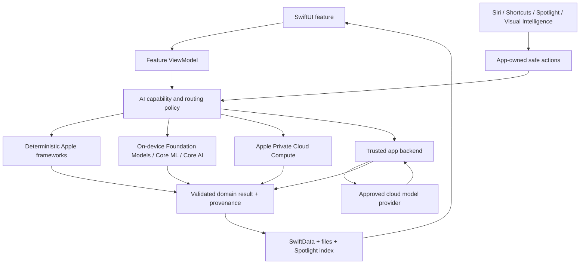

# iOS AI Capabilities Map And Practical Lab Plan

## Document Status

- **Prepared on**: 2026-07-12.
- **Purpose**: define a complete theoretical and practical learning program for modern AI work in iOS apps.
- **Primary outcome**: build one independent iOS app that demonstrates local, Apple-system, private-cloud, and third-party cloud AI patterns without collapsing them into one opaque chat screen.
- **Proposed app name**: `AI Fieldbook` (working title).
- **Current implementation state**: the independent AI Fieldbook project exists and its non-AI Iteration 1 implementation plus static remediation are complete through Block 1.25A. Manual acceptance gate 1.26 remains open; no App Intent or AI runtime has started.
- **Governing AI prompt**: `./docs/agent-prompts/AI_iOS_MASTER_PROMPT.md`; apply only task-relevant sections under current user/project rules.
- **Important platform note**: iOS 27 / Xcode 27 APIs referenced below are beta as of this plan. Stable and beta work must be isolated by availability checks and explicit experimental feature gates.

## 1. Executive Decision

Build **one modular learning app**, not many disconnected sample apps.

`AI Fieldbook` should be a multimodal personal research and learning workspace. A person can capture text, a photo, a scanned document, a PDF, an audio recording, or a web reference; enrich it locally; ask deeper cloud questions; create derived content; search private knowledge; and expose safe actions through Siri, Shortcuts, Spotlight, and Visual Intelligence.

One app is preferable because it lets us learn the difficult production concerns that isolated demos hide:

- capability and model routing;
- device and OS availability;
- offline behavior;
- local versus cloud privacy boundaries;
- streaming and cancellation;
- persistent AI artifacts and provenance;
- prompt/version management;
- tool calling and confirmation;
- retrieval-augmented generation;
- latency, energy, memory, token, and monetary cost measurement;
- evaluation and regression control;
- App Intents and system integration;
- safe failure and fallback behavior.

The app should have individual **Labs** so each technology remains observable and teachable, while a **Workspace** combines the technologies into a realistic product flow.

## 2. What Counts As “AI On iOS”

The subject has six distinct layers. They must not be mixed together.

1. **AI-assisted iOS development**: Xcode coding agents, predictive completion, external agents, MCP/ACP, prompt/skill workflows, AI-assisted localization/accessibility/testing/review.
2. **Apple Intelligence integration**: Foundation Models, Private Cloud Compute, Image Playground, Writing Tools, Siri AI, App Intents, App Schemas, Visual Intelligence, Spotlight semantic context.
3. **Apple task-specific on-device intelligence**: Vision, Speech, Translation, Natural Language, Sound Analysis, Music Understanding, Sensitive Content Analysis, ShazamKit.
4. **Custom on-device models**: Core ML, Create ML, Core AI, MLX Swift, and selected third-party runtimes.
5. **Cloud foundation models**: text, vision, documents, audio, realtime voice, image generation, structured output, tools, agents, embeddings, RAG, moderation, fine-tuning, and evaluations.
6. **Production AI engineering**: routing, consent, security, prompt injection defense, observability, evaluation, cost control, data governance, accessibility, and human control.

`App Intents` is not itself a language model. It is the structured action/entity layer that makes app capabilities available to Siri, Shortcuts, Spotlight, widgets, controls, Visual Intelligence, and Apple Intelligence.

## 3. Assessment Of The Provided Article

The article [AI for iOS Developers: The Complete Roadmap](https://medium.com/@anandgaur2207/ai-for-ios-developers-the-complete-roadmap-1e4447e155d7) provides a useful top-level distinction:

- using AI to build an iOS app;
- building AI functionality into an iOS app.

That distinction is retained in this plan. However, the article was published on 2026-05-31, before the June 2026 platform announcements. It therefore cannot be the current technical source of truth for the complete July 2026 landscape. The plan adds or updates:

- Core AI;
- the `LanguageModel` abstraction;
- `PrivateCloudComputeLanguageModel`;
- multimodal Foundation Models image input;
- Dynamic Profiles and broader agentic composition;
- built-in Vision and Spotlight tools;
- the Evaluations framework;
- iOS 27 App Schemas and App Intents changes;
- iOS 27 Image Playground changes;
- Music Understanding;
- current Xcode 27 coding agents.

The article is treated as orientation, while Apple and provider documentation are treated as authoritative implementation references.

## 4. Current Capability Inventory

### 4.1 AI-Assisted Development

| Capability | What it provides | Practical exercise | Status / caveat |
|---|---|---|---|
| Xcode predictive code completion | On-device Swift/Apple SDK completion informed by project context | Compare completion quality for SwiftUI, async code, and tests | Mature; useful but not an architecture authority |
| Xcode chat models | ChatGPT, Claude, another hosted provider, or local Chat Completions-compatible provider | Explain code, draft a focused change, compare providers | Project data can be shared with the selected provider |
| Xcode coding agents | Multi-file exploration, editing, build/test iteration, documentation search | Implement a small lab from an approved plan and review the diff | Agent output still requires human review and verification |
| ACP agents | Add third-party agents that implement Agent Client Protocol | Connect one supported agent and compare tool scope | Provider and Xcode-version dependent |
| Xcode MCP service | Give an external agent controlled access to Xcode capabilities | Let an external agent inspect/build a sample target | Permissions and data access must be explicit |
| Xcode skills/expertise | Reusable guidance for localization, accessibility, documentation, and domain workflows | Apply a skill to one feature and inspect its effect | Skills are workflow instructions, not correctness proof |
| Parallel agent workflows | Run independent planning, implementation, and review conversations | Compare independent solutions and reconcile evidence | Higher context/token cost; reserve for risk or ambiguity |
| AI-assisted prototypes | Generate multiple UI/interaction prototypes and refine manually | Produce alternatives for one Lab screen | Generated UI must be made intentional and accessible |
| AI-assisted localization | Create candidate translations and validate string catalogs | Localize AI disclosure and error states | Human linguistic review remains required |
| AI-assisted review/evaluation | Static review, threat modeling, prompt eval generation, regression analysis | Review one AI pipeline with independent criteria | Never equate model confidence with evidence |

Official reference: [Xcode coding intelligence](https://developer.apple.com/documentation/xcode/coding-intelligence).

### 4.2 Foundation Models And Apple Intelligence

| Capability | Main API / system | What we should learn | Availability class |
|---|---|---|---|
| On-device language generation | `SystemLanguageModel`, `LanguageModelSession` | instructions, prompts, sessions, streaming, context limits, availability | Apple Intelligence-capable devices; iOS 26+ baseline |
| Text understanding | Foundation Models | summarize, classify, extract, rewrite, generate, dialogue | Best for bounded tasks, not authoritative facts |
| Guided generation | `@Generable`, `Generable` | type-safe Swift output instead of fragile JSON parsing | Core production pattern |
| Tool calling | `Tool` | local DB search, calculations, app actions, remote lookup | Tool output and side effects remain app responsibility |
| Token/context inspection | `tokenCount(for:)`, `contextSize` | budget prompts and prevent context overflow | Model/OS-version dependent |
| Snapshot/streaming output | session streaming APIs | progressive UI, cancellation, partial output | Must avoid persisting incomplete output as final |
| Image input | multimodal Foundation Models prompts | image captioning, visual Q&A, document/photo understanding | iOS 27 beta path |
| Built-in OCR and barcode tools | `OCRTool`, `BarcodeReaderTool` | combine deterministic Vision extraction with LLM reasoning | iOS 27 beta path |
| Local RAG | `SpotlightSearchTool` + Core Spotlight | answer from private indexed app content | iOS 27 beta path; index quality controls answer quality |
| Dynamic agent profiles | `LanguageModelSession.DynamicProfile` | switch tools, instructions, and model behavior during a session | iOS 27 beta path |
| Model abstraction | `LanguageModel` | use on-device, PCC, or third-party model through a common Apple session model | iOS 27 beta; provider capabilities still differ |
| Apple Private Cloud Compute | `PrivateCloudComputeLanguageModel` | larger context/reasoning while retaining Apple privacy architecture | iOS 27 beta, entitlement/eligibility/region/device constraints |
| Third-party Foundation Models providers | provider package conforming to `LanguageModel` | swap compatible cloud/open models without replacing product UI | iOS 27 beta; provider package and backend security still matter |
| Foundation Models utilities | Apple’s emerging/open framework utilities | reusable agent/context practices | New and evolving; avoid making experimental utility APIs foundational |
| Custom adapters | Foundation Models Adapter Training Toolkit | domain specialization and adapter packaging | iOS 26-specific toolkit; current Apple docs say its 26.0 release is incompatible with iOS 27+
| Evaluations | `Evaluations` framework | datasets, metrics, model-as-judge, tool-call evaluation, regression comparison | iOS 27 beta path; should become a core learning stream |
| Foundation Models Instruments | Instruments template | inspect latency, tools, prompts, output, and token use | Device/runtime evidence required |
| `fm` CLI and Python SDK | development and scripting tools | prompt experiments, batch prototyping, evaluation data preparation | Development tooling, not an iOS runtime feature |

Primary references:

- [Foundation Models](https://developer.apple.com/documentation/FoundationModels)
- [Foundation Models updates](https://developer.apple.com/documentation/updates/foundationmodels)
- [Evaluations](https://developer.apple.com/documentation/Evaluations)
- [Private Cloud Compute language model](https://developer.apple.com/documentation/FoundationModels/PrivateCloudComputeLanguageModel)

### 4.3 Apple-System AI Surfaces

| Surface | Capabilities | Practical use in the lab app |
|---|---|---|
| App Intents | structured actions, parameters, entities, queries, errors, confirmation | capture an item, summarize an item, ask a workspace, generate a study plan |
| App Shortcuts | zero-setup discoverable shortcuts and phrases | expose the top four safe actions |
| Siri AI | natural-language invocation, personal context, onscreen content | ask about the current workspace or capture a spoken note |
| App Schemas | known action/entity schemas understood by Apple Intelligence | map compatible actions rather than inventing opaque custom semantics |
| App Entities | stable nouns from the app’s domain | `KnowledgeItemEntity`, `WorkspaceEntity`, `InsightEntity` |
| Interactive snippets | rich and interactive results outside the full app | preview summary, choose a generated option, confirm a safe mutation |
| Spotlight indexing | lexical and semantic discoverability | index title, extracted text, tags, and safe metadata |
| Spotlight local RAG | app index as Foundation Models grounding source | answer only from selected private workspace content |
| Visual Intelligence | image-based lookup into app content | match a photographed object/document to related saved items |
| View/entity annotations and onscreen awareness | connect visible content to app entities | let Siri understand which item is currently visible |
| Widgets, Controls, Live Activities | intent-driven actions and status | show latest local insight or long-running cloud analysis status |
| Action/Side button routes | launch shortcuts or conversational app entry points | start voice capture or open Ask mode |

Primary reference: [App Intents](https://developer.apple.com/documentation/appintents).

### 4.4 Apple Content Creation And Editing

| Capability | API | Lab exercise | Important limitation |
|---|---|---|---|
| Writing Tools | standard text controls / `UIWritingToolsCoordinator` | proofread or rewrite a user note using system UI | System-managed experience; availability depends on Apple Intelligence |
| Image Playground | `imagePlaygroundSheet`, `ImagePlaygroundViewController` | generate a cover illustration seeded by note text/photo | iOS 27 moves generation to PCC and deprecates/removes programmatic `ImageCreator`; temporary result URL must be copied durably |
| Genmoji and adaptive image glyphs | system text input and adaptive glyph support | preserve/display generated glyphs in rich text | Supporting generated glyphs is different from programmatically generating them |
| Translation | `TranslationSession`, SwiftUI translation tasks/presentation | local/system translation of captured text | Language assets and supported pairs vary |
| Speech synthesis | `AVSpeechSynthesizer` | read a summary aloud | Deterministic system TTS, not a conversational generative model |

References: [Image Playground](https://developer.apple.com/documentation/imageplayground), [Writing Tools](https://developer.apple.com/documentation/uikit/writing-tools), and [Translation](https://developer.apple.com/documentation/Translation).

### 4.5 Mature On-Device Perception And Language Frameworks

| Framework | Practical capabilities | AI Fieldbook use |
|---|---|---|
| Vision | OCR, document structure, barcode/QR, image classification, face/landmark detection, human/animal pose, hand pose, foreground/person segmentation, feature prints, similarity, saliency, quality/aesthetic signals, object tracking | scan documents, extract text, compare images, segment a selected object, create searchable visual metadata |
| VisionKit | document camera, data scanning, subject lifting and system scanning experiences | capture a clean document/photo input before AI processing |
| Speech / SpeechAnalyzer | live and file transcription, async result streams, downloadable assets, confidence/alternatives where available | voice-note capture, live captions, transcript generation |
| Natural Language | language ID, tokenization, parts of speech, lemma, named entities, sentiment, word/sentence embeddings, custom classifiers/taggers | deterministic preprocessing, language routing, local semantic similarity baseline |
| Sound Analysis | built-in classification of hundreds of sounds and custom Core ML sound classifiers | label an audio note and produce a timestamped sound timeline |
| Music Understanding | key, rhythm, structure, pace, instrument activity, loudness | optional iOS 27 audio lab; visualize and summarize a music file |
| ShazamKit | match music or custom audio signatures | optional recognition lab; distinct from general sound classification |
| Sensitive Content Analysis | detect system-defined sensitive image/video categories and recommended intervention | guard imported/generated media before display |

These frameworks are often faster, cheaper, more deterministic, and more private than asking a general-purpose LLM to do the same task. The routing policy must prefer a task-specific framework when it directly fits the requirement.

References: [Vision](https://developer.apple.com/documentation/vision), [Speech](https://developer.apple.com/documentation/speech), [Natural Language](https://developer.apple.com/documentation/naturallanguage), [Sound Analysis](https://developer.apple.com/documentation/soundanalysis), and [Sensitive Content Analysis](https://developer.apple.com/documentation/sensitivecontentanalysis).

### 4.6 Custom Model Development And Inference

| Technology | Best use | What to learn | Recommendation |
|---|---|---|---|
| Core ML | deploy converted or Create ML models with optimized Apple compute | model inputs/outputs, compute units, stateful inference, model assets, on-device updates, profiling | Required practical module; mature and broadly deployable |
| Create ML | train task-specific image, object, text, word-tagging, sound, activity, tabular, recommendation models on Mac | dataset quality, splits, metrics, overfitting, export | Required small custom-model exercise |
| Core AI | deploy modern open/custom AI architectures with `.aimodel`, Python/PyTorch conversion, specialization, AOT compilation, debugger, Instruments | modern model lifecycle, memory/latency, KV cache, model specialization | Required iOS 27 experimental module because it is Apple’s new advanced path |
| MLX Swift | research and experimentation with LLMs, VLMs, diffusion, custom training/numerics on Apple silicon | tokenizer/model loading, quantization, memory pressure, Metal packaging | Advanced comparison lab; do not make it the first production runtime |
| Metal tensors / custom kernels | specialized high-performance operations | tensor compute, GPU kernels, profiling | Later / only if a measured bottleneck or unsupported operation requires it |
| MPS Graph / Accelerate / BNNS | lower-level numerical and neural operations | custom pipelines and compatibility | Later / specialist track, not the app’s primary architecture |
| Third-party runtimes | ExecuTorch, ONNX Runtime, LiteRT/TFLite, llama.cpp and similar | portability, model conversion, binary size, GPU/ANE support, licensing | Compare one only if it adds a model Core ML/Core AI cannot reasonably run |

Core AI is new in iOS 27 and should not be confused with Core ML. Core ML remains the mature deployment framework; Core AI targets modern, highly customizable AI model execution and toolchains.

References: [Core ML](https://developer.apple.com/documentation/coreml), [Create ML](https://developer.apple.com/documentation/createml), [Core AI](https://developer.apple.com/documentation/coreai), and [MLX Swift](https://github.com/ml-explore/mlx-swift).

### 4.7 Cloud And Global AI

The app should learn **capability patterns**, not hard-code its product around one vendor’s marketing names.

#### Cloud capability classes

- text generation, rewriting, summarization, extraction, classification, and reasoning;
- multimodal image, PDF/document, audio, and video understanding;
- strict structured output / JSON Schema;
- function/tool calling;
- streaming responses;
- realtime speech-to-speech and multimodal sessions;
- speech-to-text and text-to-speech;
- image generation and editing;
- embeddings and semantic retrieval;
- hosted file search / vector stores / RAG;
- web/search grounding and citations;
- content moderation and safety classification;
- long-running/background jobs and batch processing;
- prompt caching and context reuse;
- fine-tuning or provider-specific customization;
- provider evaluations and model comparison;
- agent orchestration on a trusted backend.

#### Provider families to understand

| Provider family | Why include it | Correct iOS integration stance |
|---|---|---|
| OpenAI API | broad text/vision/files/tools/realtime/audio/image/embeddings/agent capability set | use an app backend for standard APIs; use short-lived client secrets for approved realtime client connections; never embed a long-lived API key |
| Anthropic Claude API | strong long-context document and tool workflows | backend-owned API key and provider adapter; no secret in the app |
| Google Gemini / Vertex AI | broad multimodal input, Live API, tools, grounding, images/video/audio | backend or Firebase AI Logic; Firebase mobile SDK path requires App Check, quotas, consent, and explicit provider policy |
| Apple PCC | Apple-managed server model through Foundation Models | use availability/entitlement checks and Apple’s model contract; still disclose network processing appropriately |
| Azure OpenAI | enterprise Azure governance and regional deployment | backend-only enterprise integration |
| Amazon Bedrock | managed access to multiple model families and enterprise controls | backend-only provider gateway |
| Self-hosted inference | maximum deployment/model control | backend operations, scaling, safety, monitoring, and licensing become our responsibility |

The first implementation provider should be **one provider only** to prove the architecture. OpenAI is a suitable first provider because it covers text, vision/files, structured output, tools, realtime voice, audio, image generation, embeddings, and evaluations. A second provider should be introduced only after the first provider path and capability-specific app contracts are stable.

References: [OpenAI API quickstart](https://platform.openai.com/docs/quickstart), [OpenAI API data controls](https://platform.openai.com/docs/models/default-usage-policies-by-endpoint), [Firebase AI Logic](https://firebase.google.com/docs/ai-logic), [Gemini tools](https://ai.google.dev/gemini-api/docs/tools), and [Amazon Bedrock overview](https://docs.aws.amazon.com/bedrock/latest/userguide/what-is-bedrock.html).

## 5. Essential AI Methodologies To Practice

The project is incomplete if it only calls model APIs. We must practice these engineering methods explicitly.

### 5.1 Prompt And Context Engineering

- separate stable instructions from user input;
- use structured context sections and bounded input;
- version every production prompt;
- define expected behavior for empty, ambiguous, adversarial, and oversized input;
- count tokens or estimate context before submission;
- summarize or retrieve instead of replaying an unbounded conversation;
- do not place secrets or hidden authorization decisions in prompts;
- treat model output as untrusted data.

### 5.2 Structured Generation

- use Foundation Models guided generation for local Swift structures;
- use provider structured outputs/JSON Schema for cloud structures;
- validate values after decoding even when schema adherence is promised;
- keep schema evolution and unknown enum handling explicit;
- render UI from validated domain/view state, not raw model text.

### 5.3 Tool Calling And Agents

- expose the smallest useful tool set;
- distinguish read tools from mutating tools;
- validate tool arguments independently of the model;
- require explicit confirmation for destructive, public, financial, privacy-sensitive, or difficult-to-reverse operations;
- enforce authorization in code/backend, never in the prompt;
- cap iterations, parallel calls, elapsed time, and cost;
- make tools idempotent where retries are possible;
- preserve an audit trail using sanitized operation metadata, not private prompt bodies;
- support cancellation and partial failure;
- prevent retrieved content from redefining tool policy (prompt injection defense).

### 5.4 RAG And Semantic Search

We should implement two distinct RAG paths:

1. **Local RAG**: Core Spotlight semantic index + `SpotlightSearchTool`, private and offline where supported.
2. **Cloud RAG**: backend document ingestion, chunking, embeddings, vector search, metadata filtering, source citations, and provider-independent retrieval.

Required experiments:

- lexical versus semantic retrieval;
- chunk size and overlap;
- top-k and relevance thresholds;
- source filtering by workspace/user;
- grounded answer with citations;
- refusal when evidence is absent;
- stale/deleted document removal;
- malicious instructions embedded in a document;
- local/cloud retrieval quality and latency comparison.

### 5.5 Hybrid Routing

Every AI request receives a route decision based on:

- capability required;
- data sensitivity;
- user consent;
- device/OS/model availability;
- offline/network state;
- context size;
- latency target;
- quality target;
- energy/memory constraints;
- monetary budget;
- regional/provider policy.

Recommended route order:

1. deterministic non-AI code when sufficient;
2. specialized Apple framework when sufficient;
3. on-device Foundation Models or Core ML/Core AI;
4. Apple PCC when available and appropriate;
5. approved third-party cloud model through a trusted backend;
6. explicit unavailable state — never a silent privacy-changing fallback.

### 5.6 Evaluation

Maintain an evaluation dataset per feature with:

- normal examples;
- multilingual examples;
- short and long inputs;
- empty, corrupt, and ambiguous inputs;
- sensitive data;
- prompt injection/adversarial content;
- unsupported requests;
- expected tool decisions;
- expected refusal/confirmation behavior;
- accessibility/localization edge cases.

Metrics should include:

- task correctness;
- schema validity;
- groundedness/citation accuracy;
- hallucination rate;
- tool selection and argument correctness;
- safety/refusal correctness;
- local/cloud agreement where applicable;
- latency p50/p95;
- time to first token;
- input/output token counts;
- per-request monetary cost;
- energy, thermal, peak memory, and binary/model size;
- cancellation and recovery correctness.

Model-as-judge can be a secondary signal, never the sole release gate.

## 6. Proposed App: AI Fieldbook

### 6.1 Product Vision

`AI Fieldbook` is a private-first multimodal notebook and research assistant that makes AI routing visible. It teaches the user and developer why a task ran locally, through Apple PCC, or through an approved global provider.

The product must remain useful without generative AI: users can capture, organize, search, and view items even when all model features are unavailable.

### 6.2 Target Users

- iOS engineers learning modern AI integration;
- product engineers evaluating local versus cloud AI;
- students/researchers organizing mixed media;
- technical teams needing a reference implementation for privacy-aware AI routing.

### 6.3 Primary Jobs To Be Done

1. Capture information quickly in text, image, document, PDF, or audio form.
2. Extract deterministic metadata locally.
3. Generate a concise, editable understanding of the content.
4. Ask grounded questions across a private workspace.
5. Transform content into summaries, flashcards, tasks, outlines, or visual covers.
6. Compare local and cloud AI quality, latency, privacy, and cost.
7. invoke safe app capabilities through Siri, Shortcuts, Spotlight, and Visual Intelligence.

### 6.4 Main Navigation

- **Workspace**: projects and captured knowledge items.
- **Capture**: text, camera/photo, document/PDF, voice/audio, URL.
- **Ask**: grounded assistant over selected workspace content.
- **Create**: summary, outline, flashcards, quiz, action plan, image cover.
- **Labs**: isolated technology demonstrations and local/cloud comparison.
- **Diagnostics**: availability, selected route, latency, tokens, cost, model/prompt versions, privacy state.
- **Settings & Privacy**: cloud consent, provider policy, deletion, export, diagnostics controls.

### 6.5 AI Touchpoint Map

| Feature | AI role | Preferred route | Fallback / unavailable behavior |
|---|---|---|---|
| Text capture cleanup | language ID, tokenization, optional rewrite | Natural Language + Writing Tools | keep original text unchanged |
| Photo capture | OCR, barcode, classification, segmentation | Vision | save original photo without enrichment |
| Document capture | OCR and document structure | Vision/VisionKit | save document and show extraction unavailable |
| Audio note | transcription | SpeechAnalyzer | retain audio and allow retry |
| Audio environment | sound labels/timeline | Sound Analysis | no labels; retain recording |
| Music file | rhythm/key/structure/activity | Music Understanding | feature hidden on unsupported OS |
| Local summary | bounded summary | on-device Foundation Models | deterministic excerpt or no summary |
| Structured extraction | title, entities, tags, tasks | guided generation | show original content and retry |
| Translation | translation | Translation framework first | cloud only after explicit consent |
| Image understanding | descriptive Q&A | Vision + on-device multimodal Foundation Models | deterministic Vision metadata only |
| Local private Q&A | RAG over workspace | Core Spotlight + Spotlight tool | lexical search results |
| Deep research | broader reasoning and sources | cloud model + web/search tool through backend | explicit network/provider unavailable state |
| PDF/video/audio deep analysis | multimodal model | approved cloud provider | local extraction/transcription only |
| Flashcards/quiz | structured generation | local for short inputs; cloud for large context | manual template creation |
| Action plan | structured generation + optional tools | local/cloud based on context | produce draft only |
| Agent operations | find item, create draft task, update tags | Foundation/cloud tool calling | manual UI actions |
| Realtime tutor | low-latency voice conversation | cloud realtime API | local transcription + text response + system TTS |
| Cover illustration | system image generation | Image Playground | user photo or bundled placeholder |
| Sensitive media guard | content sensitivity | Sensitive Content Analysis | conservative warning or user-controlled reveal |
| Visual lookup | match captured image to indexed items | Visual Intelligence + App Intents | in-app photo search |
| Siri/Shortcuts | natural-language entry to safe app actions | App Intents/App Schemas | full app UI |
| Custom classification | user-defined item category model | Create ML + Core ML | rule/manual tagging |
| Open-model experiment | local LLM/VLM/embedding model | Core AI | Foundation Models/Core ML route |
| Provider comparison | same bounded task across routes | local, PCC, cloud | show only available routes |
| Quality dashboard | evaluation metrics | Evaluations + app metrics | export raw sanitized result metadata |

### 6.6 Product States

Every AI feature must define:

- idle;
- preparing assets/model;
- awaiting permission/consent;
- queued;
- streaming/processing;
- partial result;
- completed result;
- cancelled;
- offline;
- unsupported device/OS/language;
- Apple Intelligence disabled/not ready;
- rate limited/quota exhausted;
- provider/backend unavailable;
- blocked by safety policy;
- invalid or oversized input;
- result needs user review;
- persistence failed after generation.

### 6.7 AI Result Provenance

Every persisted derived result should include:

- result ID and source item IDs;
- capability (`summary`, `transcript`, `tags`, `answer`, and so on);
- route (`deterministic`, `appleFramework`, `onDeviceModel`, `applePCC`, `thirdPartyCloud`);
- model/provider identifier safe for local display;
- prompt/template version;
- creation date;
- input content revision;
- completion state;
- citations/source references where applicable;
- user-edited flag;
- quality/feedback signal;
- cost/token/latency metadata when available;
- retention/deletion relationship to source data.

Do not store chain-of-thought or private hidden reasoning. Store only the useful result, citations, decisions needed for product behavior, and sanitized operational metadata.

## 7. Architecture Proposal

### 7.1 Style

- SwiftUI app.
- MVVM with explicit intent methods.
- Coordinator only for real multi-screen/deep-link flows.
- SwiftData for local app-owned persistence.
- Capability-specific services; avoid one giant universal `AIManager`.
- Reusable packages own mechanisms; the app owns product prompts, routing policy, privacy decisions, schemas, and UI.
- Backend owns cloud credentials, provider APIs, server-side tools, quotas, and provider telemetry.

### 7.2 High-Level Flow

### 7.3 Capability-Specific Boundaries

Prefer narrow responsibilities such as:

- text understanding and structured generation;
- image/document analysis;
- speech transcription;
- sound/music analysis;
- semantic retrieval;
- realtime conversation;
- image creation;
- tool execution;
- evaluation and diagnostics.

Do not force every provider into a lowest-common-denominator protocol. Normalize the product result, while allowing route-specific capability and diagnostics where they materially differ.

### 7.4 Backend Responsibilities

The cloud path requires a small trusted backend with:

- app/user authentication;
- no long-lived provider keys in the app;
- provider request signing and key rotation;
- short-lived client credentials where a realtime API requires direct client transport;
- request size/type validation;
- user and device quotas;
- cost budgets and hard caps;
- rate limiting;
- provider timeout, retry, and cancellation policy;
- idempotency keys for mutations/jobs;
- streaming relay where needed;
- temporary file lifecycle and deletion;
- PII-aware logging/redaction;
- prompt/template version selection;
- tool authorization and execution;
- optional RAG ingestion/vector search;
- safety/moderation policy;
- provider outage/fallback policy;
- sanitized observability and billing metrics.

### 7.5 Existing Reusable Package Strategy

Current relevant assets in this worktree:

- `./PackagesInUse/AppOnDeviceAI`: existing local Foundation Models mechanism boundary.
- `./PackagesInUse/AppIntentSupport`: generic App Intents normalization/support helpers.
- `./PackagesInUse/AppNetworking`: reusable transport mechanics.
- `./PackagesInUse/AppFileStorage`: durable file mechanics.
- `./PackagesInUse/AppObservability` or vault equivalent when adopted: generic spans/measurements.
- `./PackagesInUse/AppPermissions`: permission state mechanics.

For the independent learning app, copy only packages that solve a current requirement. Do not make the new app depend on source-app product types or names.

`AppOnDeviceAI` will likely need a deliberate review before reuse because its current documented focus is translation and the iOS 27 `LanguageModel` ecosystem changes the shape of provider-neutral model sessions. That review is architecture/public-API work and requires an ADR before implementation.

## 8. Privacy, Security, And Safety Requirements

### 8.1 Data Classification

Classify each input before routing:

- public/non-sensitive;
- ordinary private user content;
- personal identifiers;
- precise location/contact/calendar/health-like sensitive context;
- credentials/secrets/payment data;
- child-related or regulated content;
- prohibited cloud content by product policy.

### 8.2 Cloud Consent

- Clearly show when content will leave the device.
- Name the processing class/provider policy in privacy settings.
- Obtain explicit consent before sharing personal data with a third-party AI provider.
- Allow local-only mode.
- Do not silently change from local to cloud when a local model is unavailable.
- Support revoke consent, delete cloud-associated data where applicable, and delete local artifacts.

Apple’s current App Review Guidelines explicitly require disclosure and permission before sharing personal data with third-party AI.

### 8.3 Agent Safety

- Read-only tools may run automatically only within user-selected scope.
- Draft creation may run automatically if reversible and clearly labeled.
- Mutations require validation and an undo path.
- External/public/destructive/sensitive actions require confirmation immediately before execution.
- The model never decides authorization.
- Retrieved documents and web pages are untrusted input and cannot redefine tool permissions.
- Enforce maximum tool calls, recursion depth, runtime, network requests, and budget.

### 8.4 Content Safety

- validate imported file type, size, count, duration, dimensions, and encoding;
- isolate temporary files and apply cleanup/file protection/backup policy;
- scan relevant media through Sensitive Content Analysis where the user’s system policy requests it;
- use provider moderation where required for cloud-generated/shared content;
- label generated content and preserve user control to edit, retry, reject, or revert;
- avoid authoritative medical, legal, financial, or emergency advice in the learning app;
- include safe behavior for self-harm, abuse, illegal, and sexual-content prompts if open-ended chat is exposed.

## 9. Compatibility And Test Matrix

### 9.1 Recommended Deployment Strategy

To learn all current capabilities without making beta APIs the only app path:

- **Base app target**: iOS 17+ for capture, persistence, mature Vision/Natural Language/Speech/Core ML, and cloud API paths.
- **iOS 18+ paths**: modern Vision APIs, semantic Core Spotlight behavior, Translation APIs as available.
- **iOS 26+ paths**: on-device Foundation Models, Writing Tools/Image Playground generation based on supported device state.
- **iOS 27 beta experimental paths**: Core AI, PCC model, model abstraction, multimodal Foundation Models, Dynamic Profiles, Evaluations, Spotlight tool, latest App Intents/App Schemas, Music Understanding.

If maintaining a single source target becomes unreasonably constrained by beta SDK use, create one project with two app schemes/targets sharing the same product modules:

- `AIFieldbookStable`;
- `AIFieldbookNext`.

This is still one application concept, not two unrelated apps. Start with a single target and split only when actual SDK/availability constraints prove it necessary.

### 9.2 Required Hardware

- one Apple Intelligence-capable physical iPhone for Foundation Models/Image Playground/PCC validation;
- one older/non-Apple-Intelligence device or simulator path for fallback behavior;
- iOS 27 beta device only when the experimental phase begins;
- Apple silicon Mac with enough storage/memory for Core AI/MLX experiments;
- microphone/camera access for real speech/vision verification.

## 10. Implementation Roadmap

### Phase 0 — Product And Technical Decisions

Deliverables:

- approve app concept/name and whether it is independent from source-app;
- decide stable minimum OS and iOS 27 experimental strategy;
- choose first cloud provider and backend platform;
- decide allowed data classes for cloud processing;
- define accounts, budget, and hardware;
- write ADRs for AI routing, backend/provider security, and beta API isolation;
- define initial evaluation datasets before feature code.

Exit criteria:

- no unresolved decision that would alter persistence, privacy, backend, or target structure.

### Phase 1 — Independent App Foundation

Deliverables:

- new Xcode project and sandbox-local build paths;
- SwiftUI navigation and feature shell;
- SwiftData workspace/item/result/provenance schema;
- file import/camera/audio capture foundations;
- local-only privacy mode and diagnostics shell;
- capability availability dashboard.

AI content: none required yet; this creates the reliable substrate AI needs.

### Phase 2 — Deterministic Apple Intelligence Baseline

Implement:

- Vision OCR, barcode, document recognition, classification/similarity, segmentation;
- Natural Language language ID, tokens, entities, sentiment/embedding experiment;
- SpeechAnalyzer transcription;
- Sound Analysis;
- Translation;
- Sensitive Content Analysis where applicable.

Learning goal: recognize when a specialized framework is better than an LLM.

### Phase 3 — On-Device Foundation Models

Implement:

- availability and locale handling;
- bounded summarization;
- guided structured extraction;
- streaming and cancellation;
- tool calling against a read-only local item lookup;
- token/context budgeting;
- result provenance and prompt versions;
- unavailable/disabled/not-ready fallback UX.

### Phase 4 — Local Search And RAG

Implement:

- Core Spotlight indexing and lifecycle;
- lexical and semantic in-app search;
- iOS 27 `SpotlightSearchTool` local RAG;
- citations to local items;
- no-evidence refusal;
- deletion and stale-index verification.

### Phase 5 — App Intents And Apple-System Integration

Implement:

- app entities and queries;
- intents for capture, summarize, ask workspace, and create study material;
- App Shortcuts and localized phrases;
- interactive snippets;
- Spotlight donations/indexing;
- Siri onscreen entity context;
- Visual Intelligence match/open path;
- confirmation for mutating/sensitive actions;
- App Intents error states and availability.

### Phase 6 — Cloud Backend And First Global Model

Implement:

- trusted backend and app authentication;
- one provider adapter;
- streaming text/structured output;
- image/PDF/audio input path as supported;
- tool calling through backend authorization;
- quotas, cost caps, cancellation, errors, and observability;
- explicit cloud consent and local-only mode.

Do not add a second provider in this phase.

### Phase 7 — Cloud RAG And Grounded Research

Implement:

- ingestion and chunking;
- embeddings and vector retrieval;
- user/workspace isolation;
- source citations;
- prompt injection defenses;
- grounded web research through an approved search tool;
- local-versus-cloud RAG comparison.

### Phase 8 — Realtime Voice And Multimodal Conversation

Implement:

- low-latency voice session;
- interruption/turn detection;
- transcript and audio output states;
- ephemeral client credential or backend relay pattern;
- reconnect, cancellation, background/interruption handling;
- local fallback: Speech transcription → local text model → system TTS.

### Phase 9 — Content Creation

Implement:

- Writing Tools integration;
- Image Playground sheet and durable result copying;
- optional cloud image generation/editing comparison;
- generated-content labeling, moderation, storage, and deletion;
- user edit/retry/revert controls.

### Phase 10 — Custom ML With Create ML And Core ML

Implement a deliberately small, measurable model, for example:

- personalized item-category classifier;
- custom sound classifier; or
- visual object/category classifier.

Exercise:

- collect/licence data;
- train/validation/test split;
- baseline metrics;
- model integration;
- confidence threshold and unknown state;
- optional on-device update/personalization;
- model version migration and rollback.

### Phase 11 — Core AI And Open Models

Implement one iOS 27 experimental path:

- select a small supported open model from Apple’s Core AI model ecosystem;
- convert/package as `.aimodel`;
- integrate Swift inference;
- measure specialization time;
- add AOT compilation if justified;
- inspect memory, latency, energy, and output quality;
- compare against Foundation Models/Core ML/cloud for the same bounded task.

Optional follow-up: repeat with MLX Swift only if the comparison adds unique learning value.

### Phase 12 — Agentic Workflow

Build one constrained agent workflow:

> “Use my selected sources to create a study plan, draft five flashcards, and propose three tasks.”

Tools:

- search selected workspace;
- read item content;
- create draft flashcards;
- create draft tasks;
- update local tags after confirmation.

Required controls:

- scope selected by user;
- visible plan/progress;
- bounded tool loop;
- confirmation before committed mutations;
- cancellation;
- idempotency;
- audit/provenance;
- partial success recovery.

### Phase 13 — Evaluations, Performance, Security, And Release Gate

Deliverables:

- Apple Evaluations suites for compatible model paths;
- provider-independent app evaluation dataset and runner;
- prompt/model regression dashboard;
- local/cloud quality-cost-latency comparison report;
- Instruments runs for Foundation Models/Core AI;
- Time Profiler, memory, energy, and network checks;
- prompt injection and tool authorization review;
- privacy manifest/App Privacy assessment;
- data retention/deletion verification;
- accessibility/localization review;
- offline and unsupported-device matrix;
- release/non-release decision for every beta feature.

## 11. Acceptance Criteria For The Finished Learning Program

The program is complete only when:

1. The app works as a useful capture/search workspace without AI.
2. At least five task-specific Apple frameworks are implemented and compared with an LLM approach where relevant.
3. On-device Foundation Models supports structured output, streaming, cancellation, availability, and one safe tool.
4. Local semantic search and grounded answers include source references.
5. App Intents expose actions and entities through Shortcuts/Siri with correct errors and confirmation.
6. One cloud provider supports secure backend-mediated streaming, multimodal input, structured output, and tools.
7. One realtime voice flow works with interruption and fallback behavior.
8. One generated-image flow works with disclosure, persistence, and deletion.
9. One custom model is trained, evaluated, deployed, and versioned.
10. One Core AI open-model experiment is profiled on a physical supported device.
11. One constrained agent workflow is safe, bounded, cancellable, and auditable.
12. Every persisted AI result carries route/model/prompt/source provenance.
13. Users can choose local-only mode and understand when data leaves the device.
14. Evaluation data catches prompt/model regressions.
15. The final report compares quality, privacy, latency, energy, memory, token usage, and monetary cost.

## 12. Required Accounts, Tools, And Budget Inputs

Before cloud or iOS 27 implementation begins, confirm:

- Apple Developer Program membership;
- Xcode 27 beta availability and a compatible beta test device;
- Apple Intelligence enabled and supported language/region;
- required Apple entitlements for PCC/adapters/sensitive-content features where applicable;
- first cloud provider account and billing cap;
- backend hosting and secrets manager;
- App Attest/App Check strategy where applicable;
- test media/document dataset licensing;
- maximum monthly experiment budget;
- whether generated/user content may be uploaded to third-party AI;
- whether the resulting app is internal learning software, TestFlight software, or intended for App Store release.

## 13. Priorities

### Must Do Now

- complete and accept Iteration 1 manual gate 1.26;
- validate crash recovery, relaunch durability, migration, permissions, accessibility, localization, privacy report, and performance on authorized runtimes;
- keep App Intents, AI, cloud providers, credentials, backend work, and beta SDK integration blocked until their later gates.

### Should Do Next

- after gate 1.26 acceptance, start Iteration 2 with the bounded App Intents foundation;
- implement deterministic Apple frameworks before generative features;
- build evaluation fixtures at the same time as each AI feature;
- complete on-device Foundation Models and App Intents before cloud-agent complexity.

### Later / Only If Needed

- second cloud provider;
- MLX comparison after Core AI;
- custom Foundation Models adapters (especially because the iOS 26 toolkit is not compatible with iOS 27);
- low-level Metal/MPS custom operations;
- multiple app targets if a single availability-gated target proves impractical;
- production App Store distribution.

### Do Not Do / Overengineering

- do not create a separate app for every framework;
- do not build one generic `AIManager` that hides capability differences;
- do not put provider API keys in the app;
- do not silently upload private data when local AI is unavailable;
- do not expose an unrestricted autonomous agent;
- do not add multiple cloud providers before one path is correct and measured;
- do not train a frontier model from scratch;
- do not use an LLM for deterministic OCR, barcode, translation, or classification when a specialized local framework meets the need;
- do not claim quality from a few hand-picked prompts;
- do not make iOS 27 beta APIs a hidden requirement for the base app.

## 14. Current Phase 0 Decisions

Approved on 2026-07-12:

1. Distribution: internal-only learning application.
2. Product: independent app with working name `AI Fieldbook`.
3. Current deployment target: iOS 26.0 using the verified Xcode/iOS Simulator 26.5 toolchain.
4. Available validation hardware: iOS Simulator only; no physical Apple Intelligence-capable device.
5. Xcode/iOS 27 beta: unavailable; the iOS 27 track is deferred.
6. Cloud provider: none approved.
7. Cloud budget: none.
8. Third-party cloud data transfer: prohibited; local-only is the current policy.
9. Backend: not in scope until separately approved.
10. Tests: writing or modifying test targets remains prohibited.
11. Design: native SwiftUI MVP designed in-project, without a required Figma source.
12. Iteration sequence: finish the complete non-AI user product first, then add AI capabilities one bounded block at a time.

Canonical product/architecture/sequence details:

- `./.zenflow/tasks/new-task-be0b/ai-fieldbook-product-contract.md`
- `./.zenflow/tasks/new-task-be0b/ai-fieldbook-architecture-decisions.md`
- `./.zenflow/tasks/new-task-be0b/ai-fieldbook-implementation-plan.md`

## 15. Recommended Immediate Next Step

Complete Iteration 1 gate 1.26 under an explicitly authorized validation block. Do not start
App Intents, AI, cloud credentials, backend provisioning, or beta SDK integration until the
gate is accepted and the corresponding Iteration 2 decision is opened.

## 16. Authoritative Reading List

### Apple

- [Apple Intelligence overview](https://developer.apple.com/apple-intelligence/)
- [WWDC26 Apple Intelligence guide](https://developer.apple.com/wwdc26/guides/apple-intelligence/)
- [Foundation Models](https://developer.apple.com/documentation/FoundationModels)
- [Foundation Models updates](https://developer.apple.com/documentation/updates/foundationmodels)
- [Foundation Models tool calling](https://developer.apple.com/documentation/foundationmodels/expanding-generation-with-tool-calling)
- [Evaluations](https://developer.apple.com/documentation/Evaluations)
- [Core AI](https://developer.apple.com/documentation/coreai)
- [Core ML](https://developer.apple.com/documentation/coreml)
- [Create ML](https://developer.apple.com/documentation/createml)
- [Vision](https://developer.apple.com/documentation/vision)
- [Natural Language](https://developer.apple.com/documentation/naturallanguage)
- [Speech](https://developer.apple.com/documentation/speech)
- [Translation](https://developer.apple.com/documentation/Translation)
- [Sound Analysis](https://developer.apple.com/documentation/soundanalysis)
- [App Intents](https://developer.apple.com/documentation/appintents)
- [Core Spotlight](https://developer.apple.com/documentation/corespotlight)
- [Image Playground](https://developer.apple.com/documentation/imageplayground)
- [Writing Tools](https://developer.apple.com/documentation/uikit/writing-tools)
- [Sensitive Content Analysis](https://developer.apple.com/documentation/sensitivecontentanalysis)
- [Generative AI Human Interface Guidelines](https://developer.apple.com/design/human-interface-guidelines/generative-ai)
- [App Review Guidelines](https://developer.apple.com/app-store/review/guidelines/)
- [Xcode coding intelligence](https://developer.apple.com/documentation/xcode/coding-intelligence)

### Cloud And Open Model Ecosystem

- [OpenAI API quickstart](https://platform.openai.com/docs/quickstart)
- [OpenAI API data controls](https://platform.openai.com/docs/models/default-usage-policies-by-endpoint)
- [Firebase AI Logic for Apple/mobile apps](https://firebase.google.com/docs/ai-logic)
- [Gemini tools](https://ai.google.dev/gemini-api/docs/tools)
- [Anthropic documentation](https://docs.anthropic.com/)
- [Amazon Bedrock](https://docs.aws.amazon.com/bedrock/latest/userguide/what-is-bedrock.html)
- [MLX Swift](https://github.com/ml-explore/mlx-swift)
